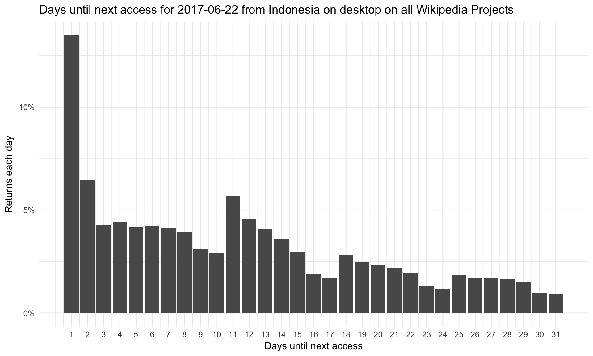
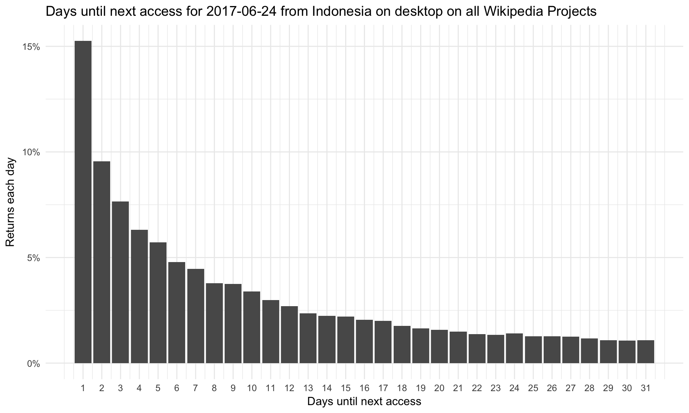
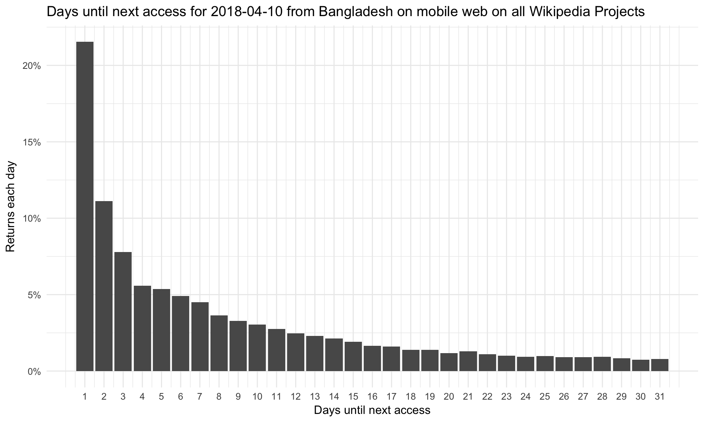
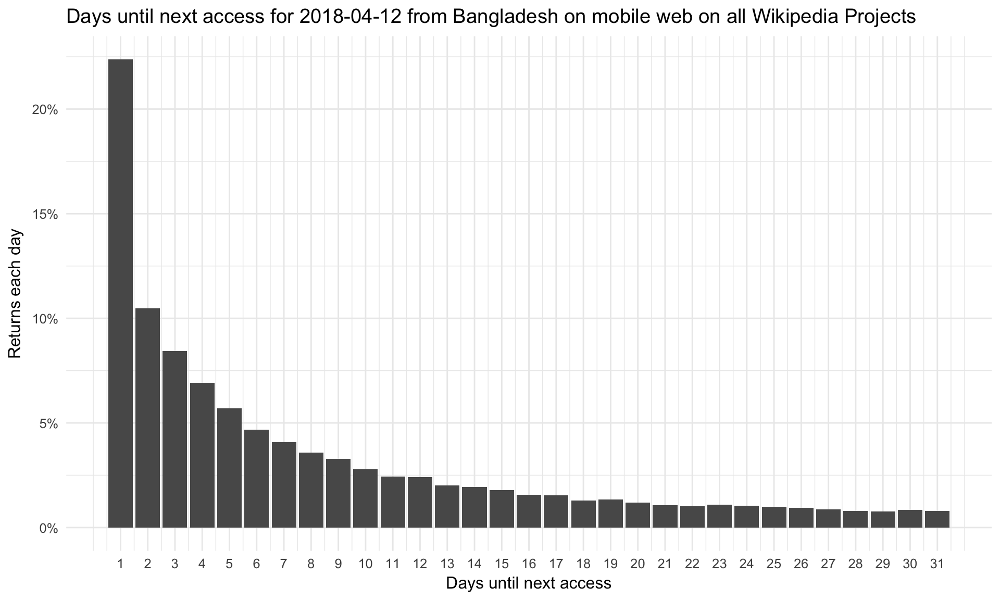
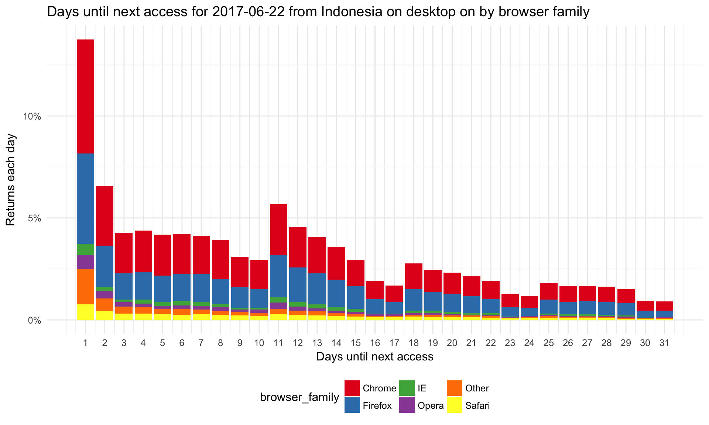
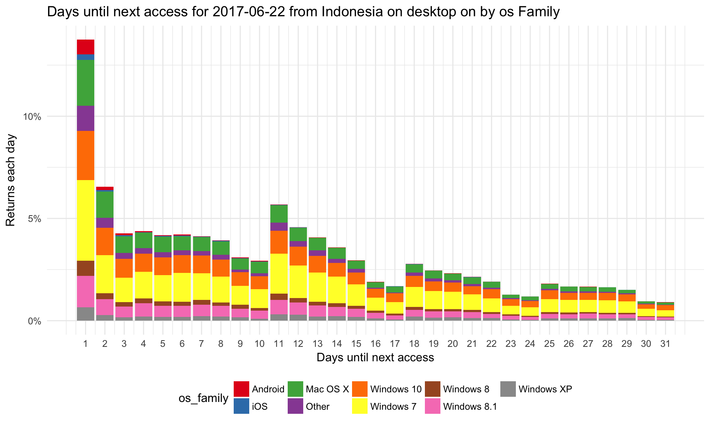
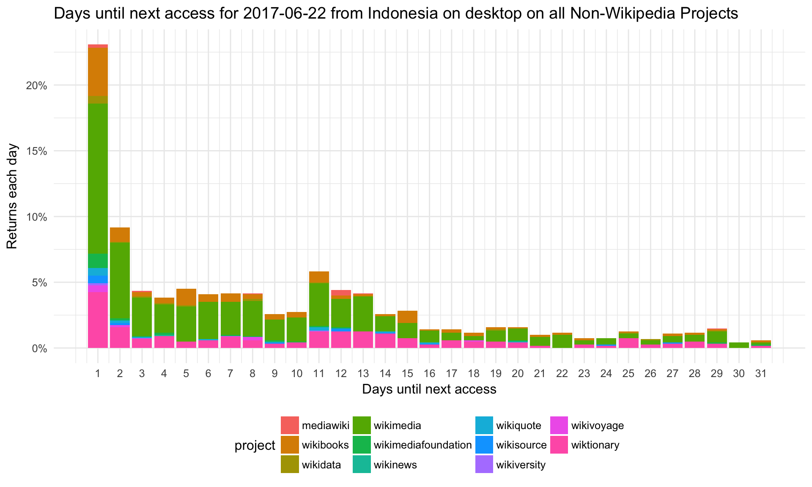

---
output:
  html_document: default
  pdf_document: default
---
#Investigate the spikes in average user return time in Indonesia and Bangladesh on Wikipedia

## Overview
Ticket: https://phabricator.wikimedia.org/T200111

There were several spikes in average user return time within 31 days for Indonesia and Bangladesh on Wikipedia, based on the last access data recorded in tbayer.webrequest_extract_bak. We'd like to investigate these spikes to learn more about the behavior of this new metric and what caused the average to go up.

Potential direction for investigation:

- Plot histograms showing the frequency of next return data, separately for a few days around the identified spike.
- Break out histograms by project type, browser and os type.
- Compare to historgrams during 'normal' days.

## Indonesia frequency of next return data

In Indonesia, all of the identified avg return time spikes occurred on desktop. I investigated the spike on June 22, 2017 (9.9 days on desktop), on December 22, 2017 (8.5 days on desktop), and on February 9, 2018 (8.6 days on desktop). For dates leading up to the spike, the histograms show an inconsistent decline after day 1. For example, on June 22nd, the numbers of unique devices returning after 11 days increases compared to those returning after 10 days. Starting on June 24th, the histogram shows a consistent decline in the frequency of returns from day 1 to day 31.

See histograms for June 22, 2017 (peak date) and June 24, 2017 below:

## Bangladesh frequency of next return data

In Bangladesh, I investigated the spikes on January 27, 2017 (13 days on desktop), December 30, 2017 (7.7 days on mobile, and April 10, 2018 (7.6 days on mobile). Compared to Indonesia, histograms for days around each of these peaks showed a higher return rate on day 1 and a consistent decline in returns on the following days (2 to 31). See histograms for April 10, 2018 (peak date) and April 12, 2018 below as an example.

## Break down by os, browser and project

I also broke down each histogram by project (specifically looking at non-wikipedia projects, os, and browser type). The breakdowns appear equally distributed indicating that the increases in average return time during these times are a result of real user behavior and not an artifact. Histograms for June 22, 2017 in Indonesia below:

